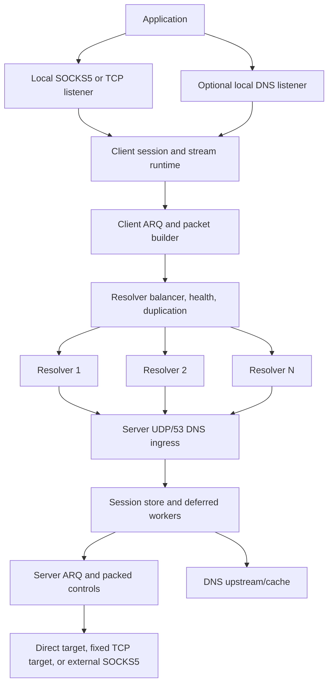
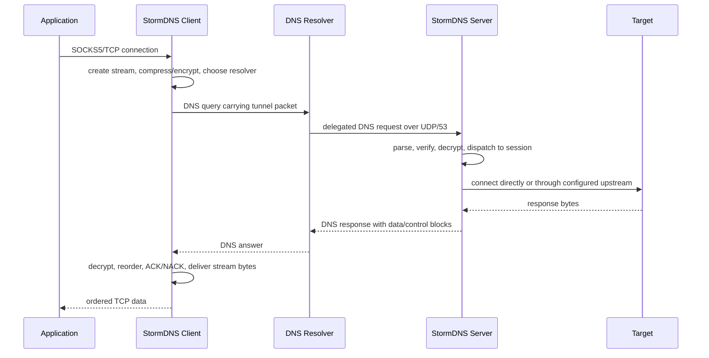

<h1 align="center">⚡ StormDNS</h1>

<p align="center">
  <strong>A DNS-based TCP tunnel for censored, lossy, high-latency networks.</strong>
</p>

<p align="center">
  <a href="LICENSE"></a>
  
  
  
</p>

<p align="center">
  <a href="README_FA.MD">فارسی</a> ·
  <a href="https://github.com/nullroute1970/StormDNS/releases/latest">Latest Release</a> ·
  <a href="https://t.me/nulllroute1970">Telegram Channel</a>
</p>

StormDNS is a client/server tunneling system that moves TCP traffic through DNS queries and DNS responses. The client runs on the user's device and exposes a local SOCKS5 proxy or a raw TCP listener. Applications connect to that local listener like they would connect to any normal proxy. StormDNS then splits each stream into small DNS-safe packets, applies optional compression and encryption, sends packets through one or more DNS resolvers, and reconstructs the stream on the remote StormDNS server. The server finally opens the real outbound connection directly, through an optional upstream SOCKS5 proxy, or to a fixed TCP target depending on configuration.

The project is built for networks where common circumvention protocols are blocked, throttled, actively probed, or unreliable, but DNS traffic still has a usable path. This includes environments with small resolver payload limits, high latency, unstable resolver behavior, weak upload bandwidth, aggressive rate limits, and frequent packet loss. StormDNS treats those problems as normal operating conditions: it uses MTU discovery, resolver health checks, multi-resolver balancing, packet duplication, ARQ retransmission, ACK/NACK handling, packet packing, and log-based startup to keep the tunnel usable when the network is hostile.

Typical deployment is straightforward: run the server on a VPS with UDP/53 reachable, delegate a short DNS subdomain to that server, put the generated encryption key and domain into the client config, add working resolvers, then point your browser or application at the local SOCKS5 listener. Advanced deployments can enable tunneled DNS handling, tune resolver/MTU behavior, chain server egress through another SOCKS5 proxy, or run the client as a Linux service.

> [!NOTE]
> DNS tunneling is constrained by resolver payload size, latency, rate limits, and packet loss. StormDNS is built for usable connectivity under pressure, not for unrealistic benchmark-only claims or replacing a normal VPN on clean, high-bandwidth networks.

## 💸 Financial Support

Financial support is optional. If you want to support ongoing development, use one of these wallet addresses:

| 💰 Network | 🔐 Address |
| --- | --- |
| TON | `UQDfjVk2UdpiMg-bsxqoLa0O_icuaF20D-wWJgIJwK1Ha2Ul` |
| USDT Tron (TRC20) | `TR8ibZGKutPKoDm5nMbHFwGPFBuMKwjG6j` |
| USDT BNB Smart Chain (BEP20) | `0x8c45d6bae8a5a572b2a776779fe0bcae3d3f9107` |

## 🧭 Quick Navigation

| Area | Go To |
| --- | --- |
| 🚀 First deployment | [Quick Start](#quick-start), [Server Setup](#server-setup), [Container Setup](#container-setup), [Client Setup](#client-setup) |
| 🌐 DNS/domain requirements | [Network And Domain Requirements](#network-and-domain-requirements) |
| ⚙️ Configuration | [Configuration Overview](#configuration-overview), [Current Config Keys](#current-config-keys) |
| 📡 Resolver and MTU tuning | [Resolver, MTU, And Loss Tuning](#resolver-mtu-and-loss-tuning) |
| 🧱 Architecture | [Architecture](#architecture) |
| 🧯 Problems and fixes | [Troubleshooting](#troubleshooting) |
| 🧑‍💻 Development | [Development](#development) |

## 🎯 Built For Hostile Networks

| Network Reality | StormDNS Response |
| --- | --- |
| 📏 DNS payloads are small | Low protocol overhead, DNS-safe encoding, active MTU discovery |
| 📉 Packet loss is normal | ARQ windows, ACK/NACK, retransmission timers, terminal drain handling |
| 📡 Resolvers degrade or disappear | Health checks, runtime auto-disable, background recheck, stream failover |
| ⬆️ Upload is often the bottleneck | Separate duplication controls for data, ACKs, setup, and control packets |
| 🕒 Startup can be expensive | Resolver cache logs and log-based startup mode |
| 🧪 Resolver behavior is inconsistent | Per-resolver MTU validation and balancing strategies |
| 🧱 DPI/protocol filtering is common | DNS-only transport over ordinary UDP/53 query/response flow |

## ✨ Main Capabilities

| Category | Capabilities |
| --- | --- |
| 🌐 Transport | DNS tunnel over UDP/53, delegated tunnel domains, multi-resolver routing |
| 🧦 Local access | SOCKS5 proxy mode and raw TCP forwarding mode |
| 📡 Resolver runtime | Random, round-robin, least-loss, and lowest-latency balancing |
| 🔁 Reliability | ARQ, ACK/NACK, RTO, retry limits, stream cleanup, packed controls |
| 📦 Efficiency | MTU discovery, packet packing, optional base encoding, ZSTD/LZ4/ZLIB |
| 🔐 Security | None, XOR, ChaCha20, AES-128-GCM, AES-192-GCM, AES-256-GCM |
| 📛 DNS features | Optional client-side local DNS listener/cache and server-side upstream DNS/cache |
| 🧰 Operations | Linux systemd installers, CLI overrides, cross-platform release workflow |
| 🧪 Testing | Standard Go tests across client, server, ARQ, config, DNS, protocol, and utility packages |

## 🗂️ Repository Map

| Path | Purpose |
| --- | --- |
| `cmd/client` | Client executable entrypoint |
| `cmd/server` | Server executable entrypoint |
| `internal/client` | Client runtime, SOCKS/TCP listeners, resolver balancing, MTU, sessions |
| `internal/udpserver` | Server runtime, DNS ingress, sessions, streams, deferred workers |
| `internal/vpnproto` | StormDNS packet building, parsing, payloads, control packing |
| `internal/arq` | Reliability window, retransmission, ACK/NACK logic |
| `internal/security` | Encryption codecs and server key generation/loading |
| `internal/compression` | ZSTD, LZ4, and ZLIB integration |
| `internal/basecodec` | DNS-safe encoding helpers: lowerbase32, lowerbase36, rawbase64 |
| `internal/config` | TOML configuration loading, validation, defaults, CLI overrides |
| `internal/dnsparser` | DNS packet parsing and response creation |
| `internal/dnscache` | DNS cache storage |
| `internal/fragmentstore` | Fragment assembly storage |
| `scripts/bench` | Local integration benchmark helper |
| `.github/workflows/build-go.yml` | Manual release workflow and artifact packaging |

<a id="quick-start"></a>

## 🚀 Quick Start

### 1. Prepare DNS

Create a short delegated subdomain such as `v.example.com` and point it to a nameserver hostname that resolves to your server IP:

```text
ns.example.com  A   1.2.3.4
v.example.com   NS  ns.example.com
```

### 2. Install Server

```bash
bash <(curl -Ls https://raw.githubusercontent.com/nullroute1970/StormDNS/main/server_linux_install.sh)
```

After startup, the server prints the active encryption key and writes it to `encrypt_key.txt`.

### 3. Configure Client

Set at least these values in `client_config.toml`:

```toml
DOMAINS = ["v.example.com"]
DATA_ENCRYPTION_METHOD = 1
ENCRYPTION_KEY = "paste-server-key-here"
PROTOCOL_TYPE = "SOCKS5"
LISTEN_IP = "127.0.0.1"
LISTEN_PORT = 18000
STARTUP_MODE = "resolvers"
```

Add resolvers to `client_resolvers.txt`:

```text
8.8.8.8
1.1.1.1:53
9.9.9.9
192.0.2.0/30
[2001:4860:4860::8888]:53
```

### 4. Run Client

```bash
./StormDNS_Client_Linux_AMD64 --config client_config.toml
```

Then configure your browser or app:

```text
SOCKS5 127.0.0.1:18000
```

<a id="network-and-domain-requirements"></a>

## 🌐 Network And Domain Requirements

You need:

| Requirement | Notes |
| --- | --- |
| 🌍 Public server | A VPS or server with a public IPv4 address |
| 📡 UDP/53 reachability | Public resolvers must be able to reach your server on UDP port `53` |
| 🧩 Delegated domain | A domain/subdomain you can delegate with an `NS` record |
| 🔑 Shared key | Server-generated key copied into the client config |
| 📋 Resolver list | `client_resolvers.txt`, one resolver or CIDR per line |
| 🧪 MTU scan | The client must be able to test real resolver/domain paths |

### 🧩 DNS Delegation Details

Example DNS records:

```text
ns.example.com  A   1.2.3.4
v.example.com   NS  ns.example.com
```

Use the delegated tunnel domain in both configs:

```toml
# server_config.toml
DOMAIN = ["v.example.com"]

# client_config.toml
DOMAINS = ["v.example.com"]
```

If your DNS provider is Cloudflare, the `A` record for `ns.example.com` must be **DNS only**. It must not be proxied.

Short labels matter. A shorter domain leaves more room for payload inside the DNS query name, which is important on resolvers with tight limits.

<a id="server-setup"></a>

## 🖥️ Server Setup

### 🐧 Linux Installer

Run on the remote Linux server:

```bash
bash <(curl -Ls https://raw.githubusercontent.com/nullroute1970/StormDNS/main/server_linux_install.sh)
```

The installer:

| Step | What It Does |
| --- | --- |
| 📦 Download | Downloads the correct release artifact unless `--local` is used |
| 🧾 Config | Prepares `server_config.toml` and asks for a domain if the sample value is unchanged |
| 🚪 Port 53 | Attempts to free local port `53` and stop conflicting DNS services |
| 🔥 Firewall | Opens DNS port `53` where supported by the host firewall tool |
| ⚙️ Tuning | Applies UDP, socket buffer, file descriptor, and systemd limits |
| 🔑 Key | Starts the server once to generate `encrypt_key.txt` |
| 🧰 Service | Installs and starts the `stormdns` systemd service |
| 🧱 Egress filter | Rejects outbound TCP/53 to avoid incorrect TCP DNS behavior |

Installer options:

| Option | Description |
| --- | --- |
| `--version <TAG>` | Install a specific release tag instead of latest |
| `--local` | Use a local server binary/config from the current directory or `dist/` |
| `--uninstall` | Remove the service, tuning files, binary, config, and key from the install directory |
| `--help` | Show installer usage |

Examples:

```bash
bash <(curl -Ls https://raw.githubusercontent.com/nullroute1970/StormDNS/main/server_linux_install.sh) --version vYYYY.MM.DD.HHMMSS-abcdef0
sudo bash server_linux_install.sh --local
bash <(curl -Ls https://raw.githubusercontent.com/nullroute1970/StormDNS/main/server_linux_install.sh) --uninstall
```

Useful service commands:

```bash
systemctl status stormdns
journalctl -u stormdns -f
systemctl restart stormdns
systemctl stop stormdns
```

### 🧪 Manual Server Run

```bash
./StormDNS_Server_Linux_AMD64 --config server_config.toml
```

Useful server flags:

```text
--config <path>       path to server configuration file, default server_config.toml
--log <path>          optional log file path
--version             print version and exit
```

Every TOML key can be overridden using a lower-case dashed flag generated from the TOML key:

```bash
./StormDNS_Server_Linux_AMD64 --config server_config.toml --udp-port 5353 --log-level DEBUG
```

<a id="container-setup"></a>

## 🐳  Container Setup

This container image runs the StormDNS server in a containerized environment and supports multi-architecture builds.

It automatically:

- Boots a default configuration if none exists
- Injects your domain on first startup
- Stores persistent data in /data

Supported Architectures

- linux/amd64
- linux/arm64
- linux/arm/v7

### Podman

```bash
podman run -d \
  --name stormdns \
  --restart unless-stopped \
  -e DOMAIN=v.example.com \
  -v $(pwd)/data:/data:Z \
  -p 53:53/tcp \
  -p 53:53/udp \
  ghcr.io/nullroute1970/stormdns:latest
```

### 🐳 Docker

```bash
docker run -d \
  --name stormdns \
  --restart unless-stopped \
  -e DOMAIN=v.example.com \
  -v $(pwd)/data:/data \
  -p 53:53/tcp \
  -p 53:53/udp \
  ghcr.io/nullroute1970/stormdns:latest
```

<a id="client-setup"></a>

## 🧑‍💻 Client Setup

Download the client archive for your platform from:

```text
https://github.com/nullroute1970/StormDNS/releases/latest
```

Client release archives include:

| File | Purpose |
| --- | --- |
| `StormDNS_Client_*` | Client executable |
| `client_config.toml` | Client config template |
| `client_resolvers.txt` | Resolver list template |
| `client_linux_install.sh` | Linux systemd installer, Linux archives only |

Minimum client edits:

```toml
DOMAINS = ["v.example.com"]
DATA_ENCRYPTION_METHOD = 1
ENCRYPTION_KEY = "paste-server-key-here"
PROTOCOL_TYPE = "SOCKS5"
LISTEN_IP = "127.0.0.1"
LISTEN_PORT = 18000
STARTUP_MODE = "resolvers"
```

Run manually:

```bash
./StormDNS_Client_Linux_AMD64 --config client_config.toml
```

Windows example:

```powershell
.\StormDNS_Client_Windows_AMD64.exe --config client_config.toml
```

Useful client flags:

```text
--config <path>       path to client configuration file, default client_config.toml
--resolvers <path>    resolver file override
--version             print version and exit
```

CLI override example:

```bash
./StormDNS_Client_Linux_AMD64 --config client_config.toml --listen-port 18001 --startup-mode logs
```

### 🐧 Linux Client Service

From the extracted client release directory:

```bash
sudo bash client_linux_install.sh
```

Service commands:

```bash
systemctl status stormdns-client
journalctl -u stormdns-client -f
systemctl restart stormdns-client
```

The client service runs non-interactively. If the config still has `STARTUP_MODE = "ask"`, the installer changes it to `logs`.

<a id="configuration-overview"></a>

## ⚙️ Configuration Overview

StormDNS uses TOML configuration files. There are no environment-variable configuration paths. Runtime paths are resolved relative to the executable/config location through `internal/runtimepath` and config helpers.

### 🔐 Values That Must Match

| Meaning | Client | Server | Notes |
| --- | --- | --- | --- |
| Tunnel domain | `DOMAINS` | `DOMAIN` | Must point to the server through DNS delegation |
| Encryption method | `DATA_ENCRYPTION_METHOD` | `DATA_ENCRYPTION_METHOD` | Numeric method IDs must match |
| Encryption key | `ENCRYPTION_KEY` | contents of `ENCRYPTION_KEY_FILE` | Server creates/loads the key file |

### 🔒 Encryption Methods

| ID | Method | Practical Notes |
| --- | --- | --- |
| `0` | None | Local testing only |
| `1` | XOR | Very low overhead, weak security |
| `2` | ChaCha20 | Good stream cipher choice when overhead is acceptable |
| `3` | AES-128-GCM | Authenticated encryption |
| `4` | AES-192-GCM | Authenticated encryption |
| `5` | AES-256-GCM | Authenticated encryption |

### 📦 Compression Methods

| ID | Method | Practical Notes |
| --- | --- | --- |
| `0` | OFF | No compression |
| `1` | ZSTD | Better ratio, more CPU |
| `2` | LZ4 | Fast and practical default for weak devices |
| `3` | ZLIB | Compatibility-oriented option |

### 📡 Resolver Balancing Strategies

| ID | Strategy | Notes |
| --- | --- | --- |
| `1` | Random | Simple distribution |
| `2` | Round-robin | Even rotation |
| `3` | Least loss | Uses runtime feedback to avoid lossy paths |
| `4` | Lowest latency | Uses runtime feedback to prefer faster paths |

### 🚦 Startup Modes

| Value | Behavior |
| --- | --- |
| `ask` | Prompt interactively; auto-selects resolver scan after 10 seconds |
| `resolvers` | Always scan `client_resolvers.txt` and test MTU |
| `logs` | Start from previous `resolver_cache_*.log` files, fall back to resolver scan if needed |

<a id="current-config-keys"></a>

## 📚 Current Config Keys

The sample files are the source of truth for defaults and operational comments:

| File | Purpose |
| --- | --- |
| `client_config.toml.simple` | Current client config template |
| `server_config.toml.simple` | Current server config template |
| `client_resolvers.simple` | Resolver list example |

### 📘 Client Config Key Groups

| Group | Keys |
| --- | --- |
| 🪪 Tunnel identity/security | `DOMAINS`, `DATA_ENCRYPTION_METHOD`, `ENCRYPTION_KEY` |
| 🧦 Local proxy | `PROTOCOL_TYPE`, `LISTEN_IP`, `LISTEN_PORT`, `SOCKS5_AUTH`, `SOCKS5_USER`, `SOCKS5_PASS` |
| 📛 Local DNS | `LOCAL_DNS_ENABLED`, `LOCAL_DNS_IP`, `LOCAL_DNS_PORT`, `LOCAL_DNS_CACHE_MAX_RECORDS`, `LOCAL_DNS_CACHE_TTL_SECONDS`, `LOCAL_DNS_PENDING_TIMEOUT_SECONDS`, `DNS_RESPONSE_FRAGMENT_TIMEOUT_SECONDS`, `LOCAL_DNS_CACHE_PERSIST_TO_FILE`, `LOCAL_DNS_CACHE_FLUSH_INTERVAL_SECONDS` |
| 📡 Resolver/loss handling | `RESOLVER_BALANCING_STRATEGY`, `UPLOAD_PACKET_DUPLICATION_COUNT`, `DOWNLOAD_PACKET_DUPLICATION_COUNT`, `UPLOAD_SETUP_PACKET_DUPLICATION_COUNT`, `DOWNLOAD_SETUP_PACKET_DUPLICATION_COUNT`, `STREAM_RESOLVER_FAILOVER_RESEND_THRESHOLD`, `STREAM_RESOLVER_FAILOVER_COOLDOWN`, `RECHECK_INACTIVE_SERVERS_ENABLED`, `RECHECK_INACTIVE_INTERVAL_SECONDS`, `RECHECK_SERVER_INTERVAL_SECONDS`, `RECHECK_BATCH_SIZE`, `AUTO_DISABLE_TIMEOUT_SERVERS`, `AUTO_DISABLE_TIMEOUT_WINDOW_SECONDS`, `AUTO_DISABLE_MIN_OBSERVATIONS`, `AUTO_DISABLE_CHECK_INTERVAL_SECONDS`, `BASE_ENCODE_DATA` |
| 📦 Compression | `UPLOAD_COMPRESSION_TYPE`, `DOWNLOAD_COMPRESSION_TYPE`, `COMPRESSION_MIN_SIZE` |
| 📏 MTU discovery | `MIN_UPLOAD_MTU`, `MIN_DOWNLOAD_MTU`, `MAX_UPLOAD_MTU`, `MAX_DOWNLOAD_MTU`, `MTU_TEST_RETRIES_RESOLVERS`, `MTU_TEST_TIMEOUT_RESOLVERS`, `MTU_TEST_PARALLELISM_RESOLVERS`, `MTU_TEST_RETRIES_LOGS`, `MTU_TEST_TIMEOUT_LOGS`, `MTU_TEST_PARALLELISM_LOGS` |
| ⚙️ Workers/queues/timers | `RX_TX_WORKERS`, `TUNNEL_PROCESS_WORKERS`, `TUNNEL_PACKET_TIMEOUT_SECONDS`, `DISPATCHER_IDLE_POLL_INTERVAL_SECONDS`, `TX_CHANNEL_SIZE`, `RX_CHANNEL_SIZE`, `RESOLVER_UDP_CONNECTION_POOL_SIZE`, `STREAM_QUEUE_INITIAL_CAPACITY`, `ORPHAN_QUEUE_INITIAL_CAPACITY`, `DNS_RESPONSE_FRAGMENT_STORE_CAPACITY`, `SOCKS_UDP_ASSOCIATE_READ_TIMEOUT_SECONDS`, `CLIENT_TERMINAL_STREAM_RETENTION_SECONDS`, `CLIENT_CANCELLED_SETUP_RETENTION_SECONDS` |
| 🔄 Session init/ping | `SESSION_INIT_RETRY_BASE_SECONDS`, `SESSION_INIT_RETRY_STEP_SECONDS`, `SESSION_INIT_RETRY_LINEAR_AFTER`, `SESSION_INIT_RETRY_MAX_SECONDS`, `SESSION_INIT_BUSY_RETRY_INTERVAL_SECONDS`, `PING_AGGRESSIVE_INTERVAL_SECONDS`, `PING_LAZY_INTERVAL_SECONDS`, `PING_COOLDOWN_INTERVAL_SECONDS`, `PING_COLD_INTERVAL_SECONDS`, `PING_WARM_THRESHOLD_SECONDS`, `PING_COOL_THRESHOLD_SECONDS`, `PING_COLD_THRESHOLD_SECONDS`, `PING_WATCHDOG_TIMEOUT_SECONDS` |
| 🔁 ARQ/packing | `MAX_PACKETS_PER_BATCH`, `ARQ_WINDOW_SIZE`, `ARQ_INITIAL_RTO_SECONDS`, `ARQ_MAX_RTO_SECONDS`, `ARQ_CONTROL_INITIAL_RTO_SECONDS`, `ARQ_CONTROL_MAX_RTO_SECONDS`, `ARQ_MAX_CONTROL_RETRIES`, `ARQ_INACTIVITY_TIMEOUT_SECONDS`, `ARQ_DATA_PACKET_TTL_SECONDS`, `ARQ_CONTROL_PACKET_TTL_SECONDS`, `ARQ_MAX_DATA_RETRIES`, `ARQ_DATA_NACK_MAX_GAP`, `ARQ_DATA_NACK_INITIAL_DELAY_SECONDS`, `ARQ_DATA_NACK_REPEAT_SECONDS`, `ARQ_TERMINAL_DRAIN_TIMEOUT_SECONDS`, `ARQ_TERMINAL_ACK_WAIT_TIMEOUT_SECONDS` |
| 📝 Logging/startup | `LOG_LEVEL`, `LOG_TO_FILE`, `LOG_DIR`, `LOG_FILE_NAME`, `STATS_REPORT_INTERVAL_SECONDS`, `STARTUP_MODE`, `LOG_SCAN_MAX_DAYS`, `LOG_SCAN_MAX_RESOLVERS`, `LOG_BASED_MTU_VERIFY`, `CONFIG_VERSION` |

### 📗 Server Config Key Groups

| Group | Keys |
| --- | --- |
| 🪪 Tunnel policy | `DOMAIN`, `PROTOCOL_TYPE`, `SUPPORTED_UPLOAD_COMPRESSION_TYPES`, `SUPPORTED_DOWNLOAD_COMPRESSION_TYPES` |
| 🚪 UDP listener/capacity | `UDP_HOST`, `UDP_PORT`, `UDP_READERS`, `DNS_REQUEST_WORKERS`, `MAX_CONCURRENT_REQUESTS`, `SOCKET_BUFFER_SIZE`, `MAX_PACKET_SIZE`, `DROP_LOG_INTERVAL_SECONDS` |
| 🧵 Deferred runtime/queues | `DEFERRED_SESSION_WORKERS`, `DEFERRED_SESSION_QUEUE_LIMIT`, `SESSION_ORPHAN_QUEUE_INITIAL_CAPACITY`, `STREAM_QUEUE_INITIAL_CAPACITY`, `DNS_FRAGMENT_STORE_CAPACITY`, `SOCKS5_FRAGMENT_STORE_CAPACITY`, `MAX_STREAMS_PER_SESSION`, `MAX_DNS_RESPONSE_BYTES` |
| 🧹 Session lifecycle | `INVALID_COOKIE_WINDOW_SECONDS`, `INVALID_COOKIE_ERROR_THRESHOLD`, `SESSION_TIMEOUT_SECONDS`, `SESSION_CLEANUP_INTERVAL_SECONDS`, `CLOSED_SESSION_RETENTION_SECONDS`, `SESSION_INIT_REUSE_TTL_SECONDS`, `RECENTLY_CLOSED_STREAM_TTL_SECONDS`, `RECENTLY_CLOSED_STREAM_CAP`, `TERMINAL_STREAM_RETENTION_SECONDS` |
| 📛 DNS upstream/cache | `DNS_UPSTREAM_SERVERS`, `DNS_UPSTREAM_TIMEOUT`, `DNS_INFLIGHT_WAIT_TIMEOUT_SECONDS`, `DNS_FRAGMENT_ASSEMBLY_TIMEOUT`, `DNS_CACHE_MAX_RECORDS`, `DNS_CACHE_TTL_SECONDS` |
| 🌍 Outbound path | `SOCKS_CONNECT_TIMEOUT`, `USE_EXTERNAL_SOCKS5`, `SOCKS5_AUTH`, `SOCKS5_USER`, `SOCKS5_PASS`, `FORWARD_IP`, `FORWARD_PORT` |
| 🔐 Security | `DATA_ENCRYPTION_METHOD`, `ENCRYPTION_KEY_FILE` |
| 🔁 ARQ/packing | `MAX_PACKETS_PER_BATCH`, `PACKET_BLOCK_CONTROL_DUPLICATION`, `STREAM_SETUP_ACK_TTL_SECONDS`, `STREAM_RESULT_PACKET_TTL_SECONDS`, `STREAM_FAILURE_PACKET_TTL_SECONDS`, `ARQ_WINDOW_SIZE`, `ARQ_INITIAL_RTO_SECONDS`, `ARQ_MAX_RTO_SECONDS`, `ARQ_CONTROL_INITIAL_RTO_SECONDS`, `ARQ_CONTROL_MAX_RTO_SECONDS`, `ARQ_MAX_CONTROL_RETRIES`, `ARQ_INACTIVITY_TIMEOUT_SECONDS`, `ARQ_DATA_PACKET_TTL_SECONDS`, `ARQ_CONTROL_PACKET_TTL_SECONDS`, `ARQ_MAX_DATA_RETRIES`, `ARQ_DATA_NACK_MAX_GAP`, `ARQ_DATA_NACK_INITIAL_DELAY_SECONDS`, `ARQ_DATA_NACK_REPEAT_SECONDS`, `ARQ_TERMINAL_DRAIN_TIMEOUT_SECONDS`, `ARQ_TERMINAL_ACK_WAIT_TIMEOUT_SECONDS` |
| 📝 Logging/metadata | `LOG_LEVEL`, `CONFIG_VERSION` |

### 🌍 Server Outbound Modes

| Mode | Behavior |
| --- | --- |
| `PROTOCOL_TYPE = "SOCKS5"`, `USE_EXTERNAL_SOCKS5 = false` | Server connects directly to destinations requested by client SOCKS5 requests |
| `PROTOCOL_TYPE = "SOCKS5"`, `USE_EXTERNAL_SOCKS5 = true` | Server connects to `FORWARD_IP:FORWARD_PORT` as an upstream SOCKS5 proxy |
| `PROTOCOL_TYPE = "TCP"` | Server forwards every stream to fixed target `FORWARD_IP:FORWARD_PORT` |

<a id="resolver-mtu-and-loss-tuning"></a>

## 📡 Resolver, MTU, And Loss Tuning

Resolver choice determines whether StormDNS is usable. A resolver may work for ordinary DNS but fail for tunnel-sized labels, repeated queries, long names, or resolver-specific rate limits. Always let the client test your real resolver/domain path.

### 🧪 Practical Resolver Workflow

1. Start with the sample configs.
2. Add many candidate resolvers to `client_resolvers.txt`.
3. Run with `STARTUP_MODE = "resolvers"` for a full scan.
4. Keep `LOG_TO_FILE = true` so working resolver/MTU results are saved.
5. After a successful scan, switch to `STARTUP_MODE = "logs"` for faster startup.

```toml
STARTUP_MODE = "resolvers"
LOG_TO_FILE = true
RESOLVER_BALANCING_STRATEGY = 3
```

After a successful scan:

```toml
STARTUP_MODE = "logs"
LOG_BASED_MTU_VERIFY = true
```

### 📏 MTU Range Tuning

If startup takes too long, reduce the search range:

```toml
MIN_UPLOAD_MTU = 80
MAX_UPLOAD_MTU = 180
MIN_DOWNLOAD_MTU = 700
MAX_DOWNLOAD_MTU = 2500
```

If many resolvers fail, lower the minimums. If the tunnel is stable but slow, raise the maximums gradually and retest.

For resolver discovery with small probes and high parallelism:

```toml
STARTUP_MODE = "resolvers"
MIN_UPLOAD_MTU = 30
MAX_UPLOAD_MTU = 30
MIN_DOWNLOAD_MTU = 40
MAX_DOWNLOAD_MTU = 40
MTU_TEST_RETRIES_RESOLVERS = 1
MTU_TEST_TIMEOUT_RESOLVERS = 1.0
MTU_TEST_PARALLELISM_RESOLVERS = 200
```

### 📉 Duplication Guidance

Duplication improves delivery probability but increases DNS query volume. On weak upload links, duplicate small ACK/control packets more aggressively than bulk upload data.

Common lossy-network profile:

```toml
UPLOAD_PACKET_DUPLICATION_COUNT = 1
DOWNLOAD_PACKET_DUPLICATION_COUNT = 4
UPLOAD_SETUP_PACKET_DUPLICATION_COUNT = 2
DOWNLOAD_SETUP_PACKET_DUPLICATION_COUNT = 4
```

If upload is extremely weak, keep `UPLOAD_PACKET_DUPLICATION_COUNT` at `1`. If downloads stall, try increasing `DOWNLOAD_PACKET_DUPLICATION_COUNT` and `DOWNLOAD_SETUP_PACKET_DUPLICATION_COUNT` first.

### 📦 Compression Guidance

| Traffic Type | Suggested Compression |
| --- | --- |
| Weak CPU/device | LZ4 (`2`) |
| Compressible text/API traffic | ZSTD (`1`) or LZ4 (`2`) |
| Already-compressed traffic | OFF (`0`) or LZ4 (`2`) |
| Unstable low-bandwidth path | LZ4 (`2`) |

Compression does not help much with already-compressed data such as most video, archives, and modern HTTPS payloads.

<a id="architecture"></a>

## 🧱 Architecture



Packet flow:



## 📱 Mobile And LAN Usage

There is no official mobile app in this repository.

Usable options:

| Option | Description |
| --- | --- |
| 🖥️ LAN proxy | Run the client on a computer and let phones use it as SOCKS5 over LAN |
| 📦 Router/VPS client | Run the client on a router, mini PC, or VPS and point devices at it |
| 📱 Termux | Use Termux artifacts where supported by the release matrix |
| 🔗 Chaining | Chain another local proxy/panel into the StormDNS SOCKS5 listener |

If another device must connect to the client over LAN:

```toml
LISTEN_IP = "0.0.0.0"
SOCKS5_AUTH = true
SOCKS5_USER = "choose-a-user"
SOCKS5_PASS = "choose-a-strong-password"
```

Do not expose an unauthenticated SOCKS5 listener to the internet.

## 🏷️ Release And Artifact Names

Release tags are generated by CI in this form:

```text
vYYYY.MM.DD.HHMMSS-commithash
```

Artifacts follow this pattern:

```text
StormDNS_Client_<Platform>_<ARCH>.zip
StormDNS_Client_<Platform>_<ARCH>.tar.gz
StormDNS_Server_<Platform>_<ARCH>.zip
StormDNS_Server_<Platform>_<ARCH>.tar.gz
```

The GitHub Actions release matrix includes Windows, Linux, Linux-Legacy, macOS, and Termux/Android targets. Client packages include the executable, `client_config.toml`, and `client_resolvers.txt`. Linux client packages also include `client_linux_install.sh`. Server packages include the executable and `server_config.toml`.

<a id="development"></a>

## 🧑‍💻 Development

Requirements:

| Tool | Use |
| --- | --- |
| Go `1.25.0` | Build and test |
| Git | Version metadata and normal development |
| Python 3 | Optional local multi-target build helper |

Build current platform:

```bash
go build ./cmd/client
go build ./cmd/server
```

Run from source-built binaries:

```bash
./client --config client_config.toml
./server --config server_config.toml
```

Run checks:

```bash
go test ./...
go vet ./...
```

Targeted tests:

```bash
go test -v -run TestName ./internal/client
go test -race ./internal/client ./internal/udpserver
```

Local multi-target build:

```bash
python build.py
```

`build.py` writes binaries and README/config copies to `dist/`. The full GitHub Actions release workflow builds a larger platform/architecture matrix and creates release assets manually through `workflow_dispatch`.

## 🧯 Troubleshooting

### 🌐 Server Does Not Receive Traffic

Check DNS delegation and UDP reachability:

```bash
dig v.example.com NS
dig @ns.example.com v.example.com A
```

Also verify that UDP/53 is open in the server firewall and hosting-provider firewall, and that the nameserver record is not proxied.

### 🚧 Port 53 Is Already In Use

On many Linux systems, `systemd-resolved` binds local port `53`. The installer tries to handle this. Manual fix:

```bash
sudo nano /etc/systemd/resolved.conf
```

Set:

```text
DNSStubListener=no
```

Then:

```bash
sudo systemctl restart systemd-resolved
```

Only one DNS service can listen on the same IP/port at the same time.

### 🕒 Client Starts Slowly

Use `STARTUP_MODE = "logs"` after one successful full scan, reduce MTU search ranges, lower `MTU_TEST_RETRIES_RESOLVERS`, and remove consistently failing resolvers from `client_resolvers.txt`.

### 🧊 Tunnel Connects But Websites Stall

Lower upload and download MTU, increase download ACK/control duplication, try `RESOLVER_BALANCING_STRATEGY = 3`, and test resolvers from different networks.

### 🧦 SOCKS Works Locally But Not From Another Device

Set `LISTEN_IP = "0.0.0.0"`, open the client machine firewall for `LISTEN_PORT`, enable SOCKS5 authentication, and connect to the client machine's LAN IP from the other device.

### 🔑 Client Fails With Missing Key

The client requires `ENCRYPTION_KEY`. Copy the exact value from the server's `encrypt_key.txt` or from the server startup log line that prints the active encryption key.

### 🧾 Config Changes Do Not Apply

Restart the relevant process/service after editing TOML files:

```bash
systemctl restart stormdns
systemctl restart stormdns-client
```

## 🛡️ Security And Responsibility

StormDNS is provided as-is, without warranty. You are responsible for how you deploy it, which networks you use it on, and whether that usage is legal in your jurisdiction.

Operational safety notes:

| Rule | Reason |
| --- | --- |
| 🔑 Keep `encrypt_key.txt` private | Anyone with the key and domain can attempt to speak the tunnel protocol |
| 🧦 Do not expose unauthenticated SOCKS5 | It can become an open proxy |
| 🧭 Prefer `127.0.0.1` for listeners | Limits exposure to the local machine |
| 🔥 Open only required firewall ports | Public server needs DNS port `53`; client usually does not need public inbound access |
| 📊 Monitor logs under heavy loss | Resolver behavior changes over time |
| 🧱 Do not run another DNS server on the same port | StormDNS server needs UDP/53 for delegated tunnel traffic |

## 🤝 Contributing

Bug reports, focused performance improvements, protocol fixes, tests, and documentation updates are welcome.

Before submitting code, run:

```bash
go test ./...
go vet ./...
```

Project links:

| Resource | Link |
| --- | --- |
| Issues | <https://github.com/nullroute1970/StormDNS/issues> |
| Pull requests | <https://github.com/nullroute1970/StormDNS/pulls> |
| Telegram | <https://t.me/nulllroute1970> |

## 📄 License

StormDNS is an independent fork/derivative of MasterDnsVPN.

Original project:

| Item | Value |
| --- | --- |
| Project | MasterDnsVPN |
| Original author | Amin Mahmoudi |
| License | MIT License |

StormDNS modifications:

| Item | Value |
| --- | --- |
| Maintainer | NullRoute1970 |
| License | MIT License |

This project preserves the MIT License terms of the original project and adds independent modifications under the same license. See [LICENSE](LICENSE).
